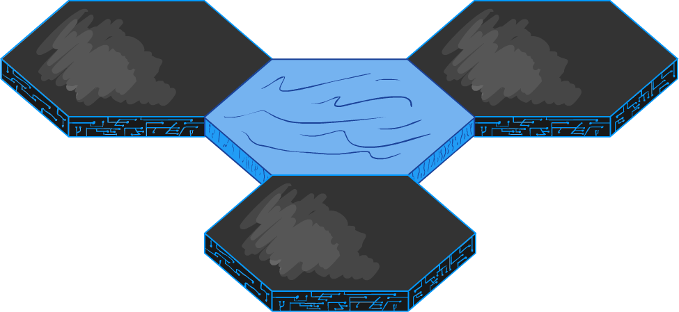
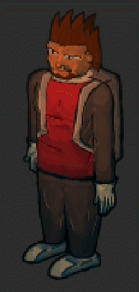
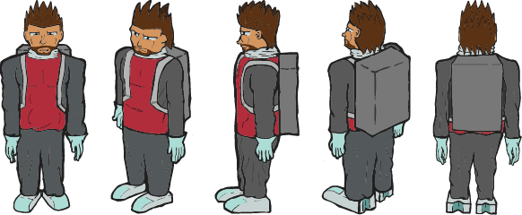

Hello everyone! It has been a while since our last update, but we have gone through a lot of development on Hexane. The core game engine is working nicely, and more progress has been made on the art assets.

First off, the hexagonal terrain have undergone a major makeover. They will no longer be hand-drawn, but rather 3D models. The pictures below show this change:

becomes

Not only has the 3D models allowed for easier implementation of movement into the game, they have also allowed for nicer, more various, and more detailed textures. We believe that this is a step in the right direction.

Alongside the hexagons, more work has gone into Casey. While a lot of work remains in doing the animations, here is what we have so far:

We hope to further refine and animate Casey over the coming weeks (he may or may not also get a remodel soon). The same goes for the rest of the art, as well as the game itself. Just stay tuned for more updates as we make further progress. We can't wait to release this game out to world for all of you to try out!
