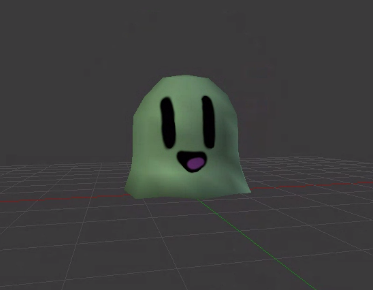

Hello everyone! We have not updated the blog for a bit, but we have managed to even get some more progress done on Hexane and our team has also grown.

We have recruited 3 more members, with a total of 5 members on the team. The new members are, Cody (3D Modeller and Sound Designer), Derick (3D Modeller) and Zack (Programmer and 3D Modeller). They will be added to the dev bio page in the upcoming days if you would like to find out more about these fine gentlemen.

Another update we have for you is that our team is now working on 2 games due to the size increase which allowed us to maintain 2 projects at a single time. Not to worry, Stew and Seby are still working on Hexane regularly while the rest are working on the new project which currently has no name and goes under the name Project Slime at the moment.

This is the picture of the default character you start as. (Work In Progress)

Project Slime has gameplay features that were inspired by the hit web game, agar.io. You play in the 3rd person perspective as a slime that must eat blobs to grow to be able to overcome his enemies (Other Players), The game is fully networked and will be the main focus of the game. We plan to provide many different customization options such as hats, trails and different slimes that can be unlocked from playing the game and earning in-game currency. We also plan to provide a couple different game modes to allow the user to experience a different game style in every mode, some examples of these modes may be subject to change but here are some examples of game-modes to expect, Free For All, Team Death Match and Capture The Flag. You can also attack other players by shooting a blob at a rock which will then move the opposite way of impact, this will result in your player losing a bit of size but if the rock hits an enemy player the player will break into smaller pieces allowing you to overcome that player.

This is it for now hope you enjoyed, we will do our very best to post more often now, stay tuned for more info on both projects.
