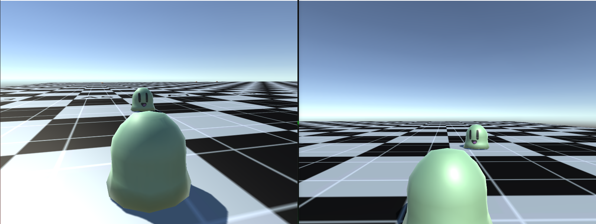
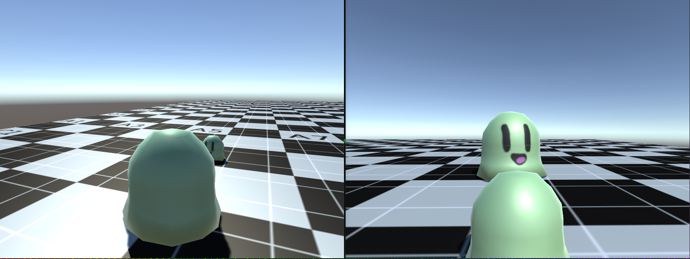

Hello everyone, we have made our final decision to switch our networking model from Bolt to TNet 3 and I have to say it is going well so far. The greatest part has to be that TNet3 supports modding over the network within its package. We have made some progress

We have made some progress on the game since we converted, here is what is done so far:

- You can start a match.
- You can join a random match.
- You spawn into the world.
- You can collect blobs to grow larger.
- You can eat other players. (Still needs work but functions are in place)

Here are some screenshots of the game so far:

Planned Additions for Next weeks post:

- Eating Players
- Rocks
- Pushing rocks
- Customization

Thank you for checking out our blog post, today's post will be small as there is not much to talk about as the conversion took quite a bit of time. Don't forget to [follow us on twitter](http://twitter.com/WolfTechGames) for updates and also subscribe to our newsletter, trust me we don't spam. Alright see you next time!

~Seby
