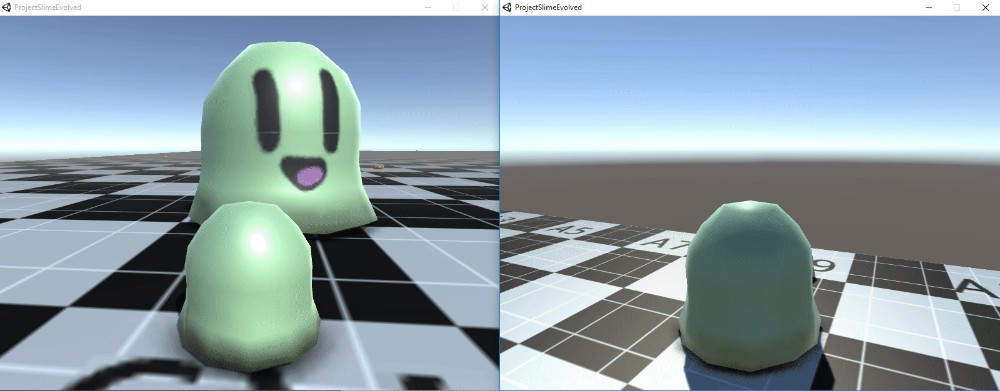
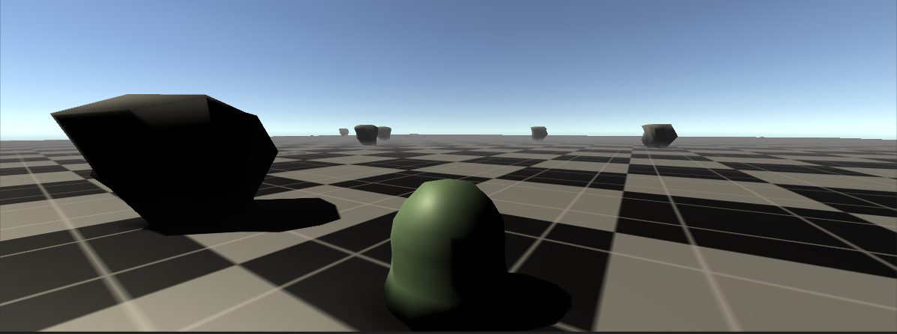

Hello everyone, this week we have gotten player eating and rocks in the game. I was wanting to add everything I mentioned in the previous post but I had a hard time getting the player eating down but in the end it seems like I completely overlooked the whole situation and it was easier then I though it would be. I kept trying to do network calls to process the eating of the player and respawning but then figured that I could have done it locally and just check if the object is yours so that it only gets called once on every object on collision. Here is a sample of the player eating:

Current Progress:
- Eating Players (Done)
- Rocks (Done)
- Shooting Blobs (In Progress)
- Pushing Rocks (In Progress)
- Customization (In Progress)

Here are some screenshots of the rocks in game:

Planned Additions for Next weeks post:

- Shooting Blobs
- Pushing rocks

Thank you for checking out our blog post sunday, hope you come back next sunday for another great blog post. Don't forget to [follow us on twitter](http://twitter.com/WolfTechGames) for updates and also subscribe to our newsletter. Alright see you next time!

~Seby
