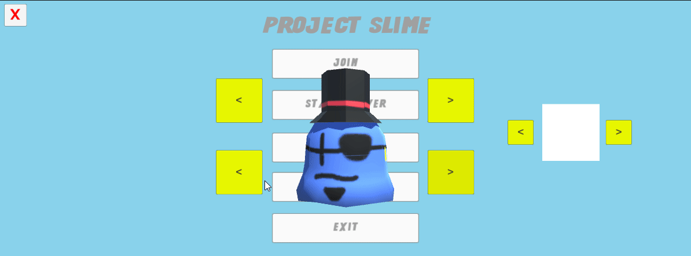
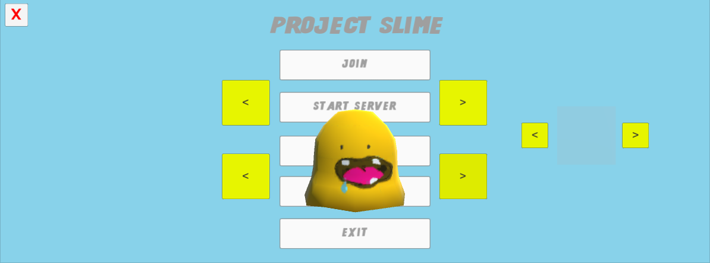
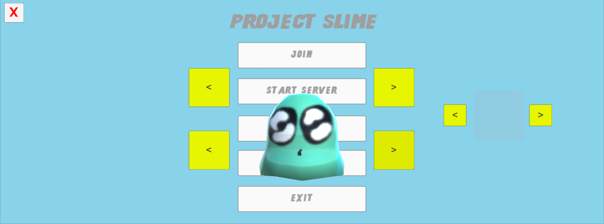
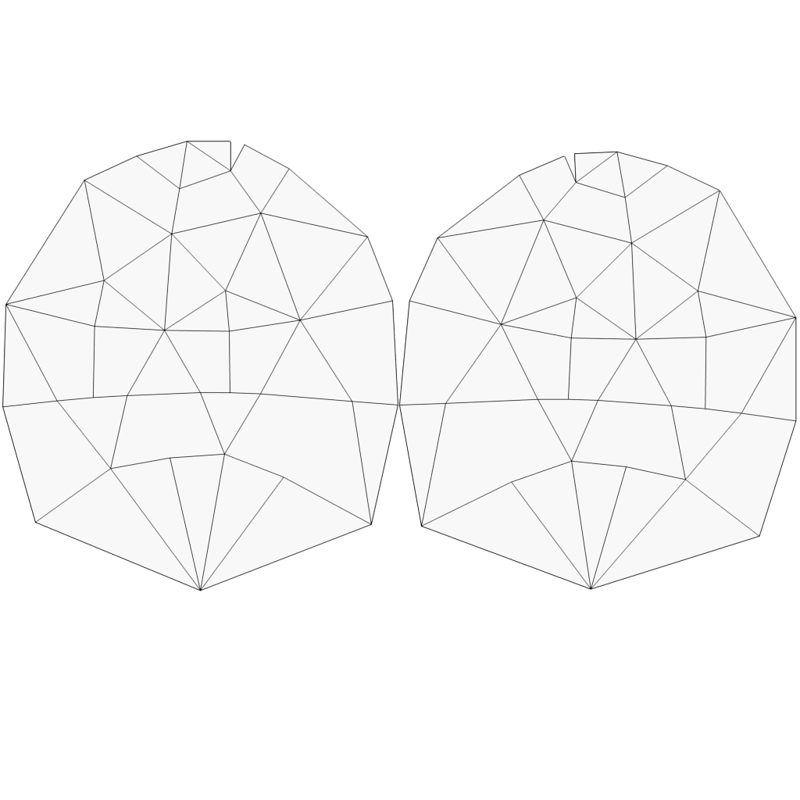
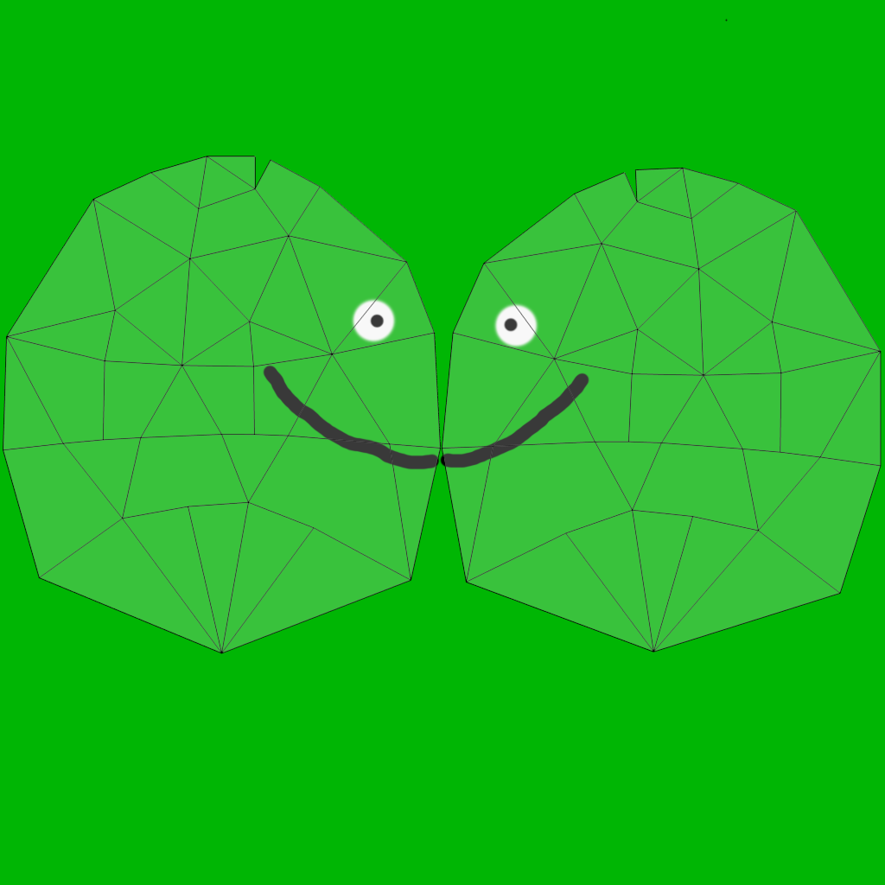

Hello everyone, sorry for the delay for the blog post, stuff kept getting in the way but we are glad that all of that is pushed aside and we are able to post now. 
So we have made quite a bit of progress on the game since last time, this includes the following: customization and optimizations

Here is a gif of the current customization:

Current Progress:

- Eating Players (Done)
- Rocks (Done)
- Shooting Blobs (Done)
- Pushing Rocks (Done)
- Customization (Done)

We have successfully completed the prototype stage and now we are heading towards the first playable copy then after that we will do our best to go straight to alpha but we want to deliver the best quality possible for this game so it may take some time.
The game will most likely be f2p with no pay to win features, we will only allow cosmetics to be purchasable in a store. We are currently looking for a solution that will allow users to upload their own skins but it may cost in game currency or you will have an optional
purchase option with real currency if you do not want to wait.

We also plan on including chests that will unlock a random cosmetic that can come in multiple rarities such as, Common, Uncommon, Rare, Epic and Legendary. We might even add one above Legendary, but that is still in the planning proccess,
if we do end up adding an additional rarity its name would have something to do with slimes. No need to worry, all chests will be fully accessible for free, there will be no keys to open chests but there will be different rarities of chests
that will offer higher chances of obtaining legendary cosmetics. Currently you will obtain chests randomly after each match you play, obviously the more rare chests will be more difficult to obtain but at the same time you will also have a
chance to obtain no chest at all. We may place the more rare chests into the store and allow you to purchase it with either in game currency or real money currency, everything in the game will be accessible without no payments required.
We want to keep it at the state where anyone can play the game without worrying about needing to purchase additions or objects to continue their progress in the game or become better. 

Here are some screenshots of 2 new slimes that have been added into the game:

Planned Additions for Next weeks post:

- Names
- Simple Gamemode system
- FFA Gamemode (Already exists but will be integrated with the new system in development)

Also for those who want to create their own slimes feel free to create one following the texture layout below (READ THE RULES FIRST):

**RULES**:
- You will NOT receive PAYMENT for completing this action wether its submitting the texture or upon acceptance.
- You will RECEIVE credit within the tooltip of the object somewhere with whatever name you would like. (You will be notified upon acceptance of your slime | Name must be appropriate)
- The texture must be mature and appropriate.
- Feel free to use the tool provided to see what the texture looks like on the slime model.

Texture and Model made by: Cody Pedro

[Texture Viewer](http://wolftechgames.com/downloads/SlimeViewer.zip)

[Submission Link](https://dbinbox.com/SlimeSubmission)

Here is a sample slime:

Thank you for checking out my blog post, hope you come back next time for another great blog post. Don't forget to [follow us on twitter](http://twitter.com/WolfTechGames) for updates and also subscribe to our newsletter. Talk to you next time!

~Seby
